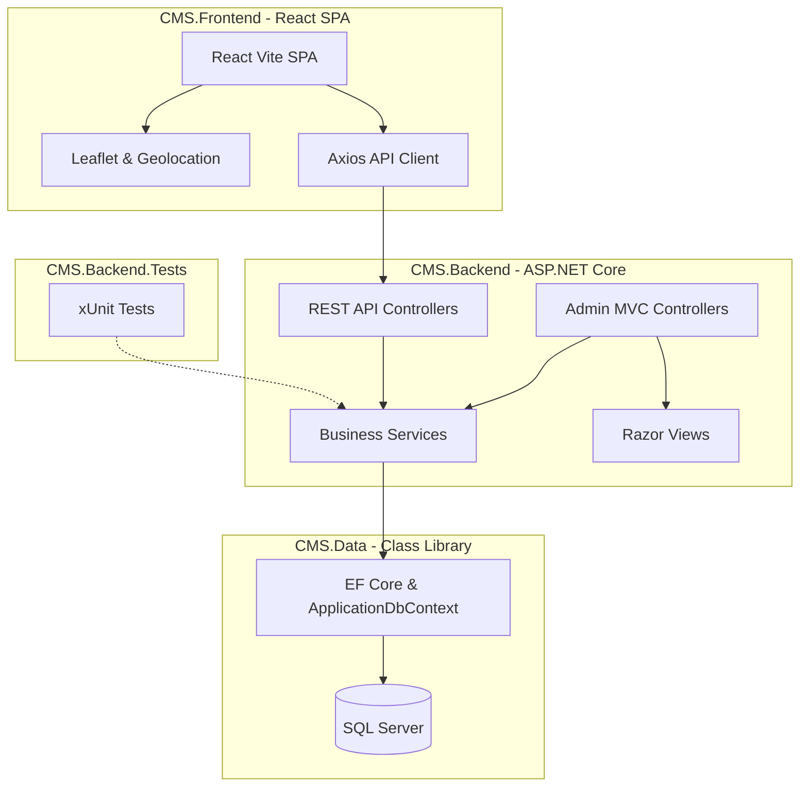

# NGUYENTRUCTRUONG CMS Solution

Hệ thống **CMS + Bán hàng Phúc Long Clone** hoàn chỉnh gồm trang quản trị Admin MVC, hệ thống REST API bảo mật và ứng dụng React SPA Client. Dự án được phát triển bằng ASP.NET Core .NET 8, Entity Framework Core, SQL Server và React Vite để quản lý và vận hành toàn diện mô hình chuỗi cửa hàng đồ uống.

---

## 1. Công nghệ sử dụng

| Thành phần | Công nghệ | Chi tiết |
|---|---|---|
| **Backend MVC/API** | ASP.NET Core 8.0 | Web API RESTful, Razor Views, Dependency Injection |
| **ORM** | Entity Framework Core 8 | Fluent API, Code-First Migrations, LINQ Queries |
| **Database** | MS SQL Server / LocalDB | Quản lý quan hệ thực thể, lưu trữ giao dịch & tồn kho |
| **Bản đồ & Định vị** | Leaflet + OpenStreetMap | Bản đồ tương tác, Geolocation API định vị tọa độ, Nominatim API để Autocomplete địa chỉ |
| **Email Service** | SMTP Client | Gửi OTP/Token quên mật khẩu thông qua SMTP Server |
| **Xác thực & Bảo mật** | Cookie & JWT Auth | Cookie Authentication cho Admin MVC; JWT Bearer Token (AccessToken & RefreshToken) cho React Client |
| **Tài nguyên Hành chính**| JSON Data | Dữ liệu Tỉnh/Thành, Quận/Huyện, Phường/Xã chuẩn Tổng cục Thống kê Việt Nam |
| **Frontend Client** | React 18 + Vite 6 | Single Page Application (SPA), React Router DOM v6 |
| **Quản lý trạng thái** | React Context API | Quản lý AuthContext (khách hàng) và CartContext (giỏ hàng, vị trí giao hàng) |
| **HTTP Client** | Axios | Axios Interceptors tự động đính kèm JWT Bearer Token và xử lý lỗi tập trung |
| **Kiểm thử** | xUnit | Unit Test cho Backend Service, EF Core InMemory DB, Coverlet đo độ bao phủ |

---

## 2. Kiến trúc tổng quan

Solution được chia thành 4 dự án thành phần theo mô hình phân lớp chuẩn:



---

## 3. Cấu trúc thư mục chi tiết

```txt
NguyenTrucTruong_Solution/
├── CMS.Backend/                     # ASP.NET Core MVC & WebAPI (Startup Project)
│   ├── Controllers/                 # Bộ điều hướng yêu cầu
│   │   └── Api/                     # Các Endpoint REST API phục vụ cho React Client
│   ├── Helpers/                     # Tiện ích upload ảnh, xử lý bảo mật JWT, mã hóa
│   ├── Models/                      # Lớp mô tả dữ liệu (DTO & ViewModel)
│   │   ├── Api/                     # Định dạng API Response chuẩn, Query Filter
│   │   ├── Dtos/                    # DTO chuyển giao dữ liệu API (ProductDto, OrderDto...)
│   │   └── ViewModels/              # ViewModel phục vụ giao diện Admin Razor Views
│   ├── Services/                    # Lớp xử lý logic nghiệp vụ chính (Business Logic)
│   │   └── Api/                     # Nghiệp vụ chuyên biệt phục vụ các API React
│   ├── Views/                       # Giao diện quản trị Admin MVC (Razor HTML)
│   ├── wwwroot/                     # Thư mục chứa tệp tĩnh (CSS, JS, ảnh tải lên)
│   │   ├── data/                    # JSON dữ liệu hành chính Tỉnh/Quận/Phường
│   │   └── js/                      # Script xử lý bản đồ và lọc địa chỉ cho Admin
│   ├── Program.cs                   # Khởi tạo Services, Middleware Pipeline, Auth, Swagger
│   └── appsettings.json             # Connection string, SMTP cài đặt và cấu hình JWT
│
├── CMS.Data/                        # Dự án liên kết Cơ sở dữ liệu (Class Library)
│   ├── Configurations/              # Cấu hình Fluent API (quan hệ 1-N, N-N, Index)
│   ├── Entities/                    # Thực thể hệ thống (Product, Customer, Order, Store...)
│   ├── Migrations/                  # Lịch sử cập nhật cấu trúc database EF Core
│   └── ApplicationDbContext.cs      # Lớp ngữ cảnh cơ sở dữ liệu chính
│
├── CMS.Backend.Tests/               # Unit Tests dự án (xUnit Project)
│   └── *.cs                         # Các kịch bản test dịch vụ API, tìm kiếm, giỏ hàng
│
├── CMS.Frontend/                    # Ứng dụng khách hàng React Vite (SPA)
│   ├── public/                      # Tệp tĩnh công cộng, favicon, dữ liệu địa chính
│   ├── src/
│   │   ├── api/                     # Cấu hình Axios Client và định nghĩa API calls
│   │   ├── assets/                  # Hình ảnh, logo, CSS toàn cục
│   │   ├── components/              # Các UI Component tái sử dụng
│   │   │   ├── common/              # Loading, Địa chỉ Dropdowns, DeliveryModal...
│   │   │   ├── home/                # Banner, Danh mục, BestSellers, NewestProducts
│   │   │   ├── layout/              # Header, Footer, ClientLayout, Nút nổi nhanh
│   │   │   ├── product/             # ProductCard, QuickOrderModal đặt món nhanh
│   │   │   ├── store/               # Bản đồ cửa hàng Leaflet, StoreLocator
│   │   │   └── order/               # Danh sách và chi tiết đơn hàng khách hàng
│   │   ├── context/                 # AuthContext (Đăng nhập), CartContext (Giỏ hàng, GPS)
│   │   ├── hooks/                   # Custom Hooks (useGeolocation, useProducts, useOrders...)
│   │   ├── pages/                   # Các trang chức năng chính (Menu, Checkout, Profile...)
│   │   ├── services/                # Tầng gọi API và định dạng dữ liệu phía client
│   │   ├── utils/                   # Hàm bổ trợ: imageHelper, addressMapper, constants...
│   │   ├── App.jsx                  # Cấu hình Routing của React Router
│   │   └── main.jsx                 # Entry point khởi tạo React DOM
│   ├── package.json                 # Cấu hình Scripts và các thư viện npm cài đặt
│   └── vite.config.js               # Cấu hình môi trường Vite
│
├── scripts/                         # Tập lệnh hỗ trợ tải dữ liệu hành chính tự động
├── NGUYENTRUCTRUONGCMS_SOLUTION.sln # Visual Studio Solution file
└── README.md                        # Tài liệu hướng dẫn sử dụng và giới thiệu dự án
```

---

## 4. Các chức năng chính đã hoàn thiện

### 🔑 Quản trị hệ thống (Admin MVC)
* **Xác thực phân quyền**: Đăng nhập bằng Cookie Authentication, phân vai trò rõ ràng giữa Quản trị viên (`Admin`) và Biên tập viên (`Editor`).
* **Quản trị Catalog**: CRUD Sản phẩm, Danh mục sản phẩm đa cấp, quản lý Option (Size, Topping, Lượng đường/đá) và cập nhật số lượng tồn kho (`Stock`).
* **Quản trị Tin tức**: Quản lý các bài viết khuyến mãi, tin tức cửa hàng bằng trình soạn thảo giàu tính năng (CKEditor) hỗ trợ tải ảnh trực tiếp lên máy chủ.
* **Quản lý bán hàng**: Theo dõi và cập nhật trạng thái đơn hàng (Chờ xác nhận, Đang xử lý, Đang giao, Đã hoàn thành, Đã hủy).
* **Quản lý Hệ thống**: CRUD Voucher giảm giá, biểu ngữ Banner quảng cáo, thiết lập danh sách cửa hàng kèm Tỉnh/Quận/Phường hành chính.

### 🌟 Trang Client cho Khách hàng (React SPA)
* **Trải nghiệm mua sắm mượt mà (Phúc Long Style)**:
  * Trang chủ sinh động với banner trượt, danh sách sản phẩm mới nhất và sản phẩm bán chạy nhất.
  * Menu xem danh sách sản phẩm kèm lọc theo khoảng giá, tìm kiếm từ khóa, và lọc theo danh mục dạng cây thư mục.
  * Đặt hàng nhanh (`Quick Order`) trực tiếp tại danh sách sản phẩm mà không cần chuyển trang.
  * Logic thay đổi Size chuyên nghiệp: Hiển thị giá chênh lệch (`+...đ` hoặc `-...đ`) của các size khác so với size mặc định hiện tại dựa trên cơ sở dữ liệu.
* **Định vị & Bản đồ Cửa hàng (Leaflet Map)**:
  * Tự động lấy tọa độ GPS của người dùng khi nhấn nút định vị.
  * Bản đồ tương tác hiển thị danh sách các cửa hàng Phúc Long xung quanh khách hàng.
  * Tìm kiếm địa chỉ với tính năng **Address Autocomplete** thông qua API Nominatim.
  * Tính khoảng cách thực tế giữa người dùng và cửa hàng gần nhất để đưa ra lựa chọn phù hợp.
* **Quy trình Thanh toán tối ưu (Checkout Flow)**:
  * Tự động chuyển hướng từ giỏ hàng sang trang thanh toán 2 cột hiện đại.
  * Xem trước hình ảnh sản phẩm trong giỏ hàng ngay tại trang checkout.
  * Chọn địa chỉ nhận hàng linh hoạt: sử dụng Sổ địa chỉ đã lưu hoặc nhập địa chỉ mới định vị bằng GPS.
  * Hệ thống áp dụng Voucher giảm giá trực quan, tự động tính toán số tiền được giảm trừ trực tiếp vào tổng đơn.
  * Hỗ trợ thanh toán khi nhận hàng (COD).
* **Quản lý tài khoản cá nhân (Customer Profile)**:
  * Đăng ký, đăng nhập tài khoản bằng JWT Token.
  * Sổ địa chỉ (`Address Book`) lưu trữ nhiều địa chỉ giao hàng và thiết lập địa chỉ mặc định.
  * Quản lý thông tin cá nhân, xem lịch sử đơn hàng chi tiết và đánh giá sản phẩm đã mua.
  * Tính năng quên mật khẩu (`Forgot/Reset Password`) qua Token an toàn gửi trực tiếp về email khách hàng qua SMTP.

---

## 5. Danh sách REST API phục vụ Frontend

| Nhóm chức năng | Phương thức | Endpoint | Mô tả |
|---|---|---|---|
| **Banners** | GET | `/api/banners` | Lấy danh sách banner đang hoạt động |
| **Xác thực** | POST | `/api/customers/register` | Đăng ký tài khoản khách hàng mới |
| | POST | `/api/customers/login` | Đăng nhập tài khoản, nhận JWT Bearer Token |
| | POST | `/api/customers/logout` | Đăng xuất tài khoản, hủy token |
| | POST | `/api/customers/forgot-password` | Gửi link/token reset mật khẩu qua email |
| | POST | `/api/customers/reset-password` | Xác thực token và thiết lập mật khẩu mới |
| **Profile** | GET | `/api/customers/profile` | Lấy thông tin tài khoản đang đăng nhập |
| | PUT | `/api/customers/profile` | Cập nhật thông tin tài khoản |
| **Địa chỉ** | GET | `/api/customers/addresses` | Lấy sổ địa chỉ của khách hàng |
| | POST | `/api/customers/addresses` | Thêm địa chỉ giao hàng mới |
| | PUT | `/api/customers/addresses/{id}` | Cập nhật địa chỉ giao hàng |
| | DELETE | `/api/customers/addresses/{id}` | Xóa địa chỉ giao hàng |
| | POST | `/api/customers/addresses/{id}/set-default` | Đặt địa chỉ làm mặc định |
| **Sản phẩm** | GET | `/api/products` | Danh sách sản phẩm kèm phân trang, lọc giá, phân loại |
| | GET | `/api/products/{id}` | Chi tiết sản phẩm theo ID kèm option size/topping |
| | GET | `/api/products/by-slug/{slug}` | Chi tiết sản phẩm theo Slug đường dẫn |
| | GET | `/api/products/newest` | Danh sách sản phẩm mới nhất |
| | GET | `/api/products/best-sellers` | Danh sách sản phẩm bán chạy nhất |
| **Danh mục** | GET | `/api/product-categories` | Lấy danh sách danh mục sản phẩm |
| | GET | `/api/product-categories/tree` | Lấy cây danh mục sản phẩm |
| **Đơn hàng** | POST | `/api/orders` | Tạo đơn hàng mới |
| | GET | `/api/orders` | Danh sách lịch sử đơn hàng của khách hàng |
| | GET | `/api/orders/{id}` | Chi tiết đơn hàng |
| | POST | `/api/orders/{id}/cancel` | Hủy đơn hàng (khi ở trạng thái chờ) |
| **Đánh giá** | GET | `/api/products/{productId}/reviews`| Lấy danh sách đánh giá của sản phẩm |
| | POST | `/api/reviews` | Tạo đánh giá sản phẩm mới |
| **Vouchers** | GET | `/api/vouchers` | Danh sách mã giảm giá khả dụng |
| | GET | `/api/vouchers/validate` | Xác thực và kiểm tra giá trị của mã voucher |
| **Cửa hàng** | GET | `/api/stores` | Lấy danh sách chuỗi cửa hàng |

---

## 6. Hướng dẫn thiết lập và chạy dự án

### Yêu cầu hệ thống
* Cài đặt **.NET SDK 8.0**
* Cài đặt **Node.js** (LTS) & **npm**
* Trình quản trị cơ sở dữ liệu **SQL Server** (hoặc LocalDB đi kèm Visual Studio)

### Bước 1: Cấu hình và chạy Backend
1. Cấu hình chuỗi kết nối Database tại tệp `CMS.Backend/appsettings.json`:
   ```json
   {
     "ConnectionStrings": {
       "DefaultConnection": "Server=YOUR_SERVER;Database=NGUYENTRUCTRUONG_DB;Trusted_Connection=True;MultipleActiveResultSets=true;TrustServerCertificate=True"
     },
     "SmtpSettings": {
       "Server": "smtp.gmail.com",
       "Port": 587,
       "SenderName": "Phuc Long Support",
       "SenderEmail": "your-email@gmail.com",
       "Username": "your-email@gmail.com",
       "Password": "your-app-password"
     }
   }
   ```
2. Thực hiện cập nhật Cơ sở dữ liệu bằng EF Core Migrations:
   ```powershell
   dotnet ef database update --project CMS.Data --startup-project CMS.Backend
   ```
3. Chạy dự án Backend:
   ```powershell
   dotnet run --project CMS.Backend
   ```
   * *Giao diện Swagger sẽ khả dụng tại đường dẫn:* `https://localhost:xxxx/swagger`
   * *Trang quản trị Admin MVC khả dụng tại:* `https://localhost:xxxx/`

### Bước 2: Cấu hình và chạy Frontend
1. Tạo tệp cấu hình `.env` trong thư mục `CMS.Frontend`:
   ```env
   VITE_API_URL=https://localhost:xxxx/api
   ```
   *(Thay thế `xxxx` bằng cổng chạy thực tế của Backend).*
2. Di chuyển vào thư mục Frontend, cài đặt các gói dependencies và chạy máy chủ phát triển (Dev server):
   ```powershell
   cd CMS.Frontend
   npm install
   npm run dev
   ```
   * *Giao diện ứng dụng Client React sẽ khả dụng tại:* `http://localhost:5173`

---

## 7. Các lệnh phát triển thường dùng

| Lệnh | Thư mục thực thi | Mục đích |
|---|---|---|
| `dotnet restore` | Thư mục gốc solution | Khôi phục các thư viện NuGet |
| `dotnet build` | Thư mục gốc solution | Biên dịch toàn bộ Solution |
| `dotnet test` | Thư mục gốc solution | Khạy các Unit Test hệ thống |
| `npm run build` | `CMS.Frontend/` | Biên dịch tối ưu mã nguồn Frontend ra thư mục `dist` |
| `npm run lint` | `CMS.Frontend/` | Kiểm tra lỗi cú pháp và định dạng mã nguồn React |

---

## 8. Tiến trình phát triển theo các Buổi (Milestones)

* **Buổi 1**: Khởi tạo cấu trúc Solution 3 lớp chuẩn nghiệp vụ. Định nghĩa các thực thể dữ liệu gốc.
* **Buổi 2**: Thiết lập Entity Framework Core DbContext, cấu hình quan hệ thực thể Fluent API và chạy Migration tạo database SQL Server.
* **Buổi 3**: Viết truy vấn LINQ, cài đặt mô hình CRUD Services, Eager Loading giải quyết triệt để lỗi N+1 query.
* **Buổi 4**: Xây dựng Layout Admin MVC, bảng điều khiển Dashboard và hoàn thành các chức năng CRUD quản trị dữ liệu cốt lõi.
* **Buổi 5**: Tích hợp Cookie Authentication cho hệ thống quản trị, cấu hình Middleware phân quyền bảo mật Admin/Editor.
* **Buổi 6**: Phát triển REST API WebAPI, tích hợp bảo mật JWT (JSON Web Token), viết các API Đặt hàng, Voucher, Đánh giá và Khách hàng.
* **Buổi 7**: Xây dựng Frontend React SPA bằng Vite, thiết kế giao diện Phúc Long chuyên nghiệp, sử dụng Context API quản lý trạng thái.
* **Buổi 8**: Tích hợp API Backend vào ứng dụng React (Menu, Giỏ hàng, Sổ địa chỉ, Đơn hàng, Trang cá nhân Profile).
* **Buổi 9**: 
  * Tích hợp bản đồ **Leaflet Map** hiển thị cửa hàng, tính khoảng cách, và tự động định vị **GPS Geolocation**.
  * Chức năng **Quên & Đặt lại mật khẩu** qua mã Token bảo mật gửi trực tiếp đến Email bằng dịch vụ SMTP.
  * Tối ưu quy trình Đặt hàng nâng cao (Checkout Flow 2 cột, voucher giảm giá trực tiếp, đồng bộ địa chỉ GPS vào sổ địa chỉ).
  * Chuyển đổi nhãn Best Seller/New sang cơ chế **Dynamic Ribbon/Badge** dựa trên lượt bán thực tế trong Database.

---

## 9. Tác giả & Thông tin liên kết

* **Sinh viên thực hiện**: Nguyễn Trúc Trường
* **Mã số sinh viên**: 23082005 (Ví dụ)
* **GitHub Repository**: [nguyentruong23082005/NGUYENTRUCTRUONGCMS_SOLUTION](https://github.com/nguyentruong23082005/NGUYENTRUCTRUONGCMS_SOLUTION)
